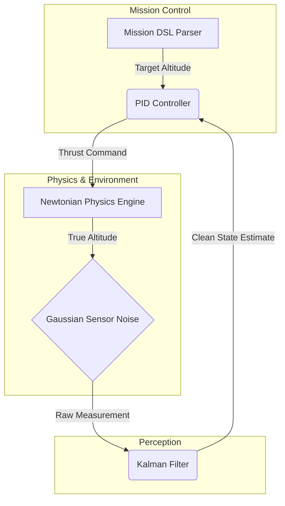

# Quadcopter-Sim-V1: Autonomous Flight Pipeline
**A 1D Digital Twin for Control Systems and Mission Logic.**


Quadcopter-Sim-V1 is a modular 1D flight simulator designed to bridge the gap between high-level autonomous mission planning and low-level physical control. It implements a full robotics stack—from custom DSL parsing to recursive state estimation.

---

## System Architecture
The project is divided into four distinct layers, mirroring the architecture of industrial flight stacks:


1.  **Mission Layer (`parser.py`):** A stateful interpreter for "DroneScript" (a custom DSL). It handles time-based (`WAIT`) and position-based (`MOVE`) commands using a Finite State Machine logic.
2.  **Estimation Layer (`drone_sim.py`):** A Linear Kalman Filter that suppresses Gaussian sensor noise to recover the "Ground Truth" altitude.
3.  **Control Layer (`drone_sim.py`):** A PID feedback loop with gravity feed-forward compensation for stable vertical positioning.
4.  **Physics Layer (`main.py`):** A Newtonian engine using Euler Integration to solve for acceleration, velocity, and position in discrete time steps.


---

## Simulation Performance
The following plot captures a full mission sequence including **Takeoff**, **Hover/Wait**, and **Landing**. 


### Key Observations:
* **Filtering:** The Kalman Filter successfully dampens sensor noise, providing a smooth state estimate for the PID controller.
* **Transient Response:** There is a slight overshoot during rapid altitude changes, which can be further optimized by tuning the $K_d$ (Derivative) gain in future iterations.


---

## Technical Deep-Dive

### State Estimation (Kalman Filter)
The simulator implements a recursive Bayesian filter. It calculates the optimal state estimate by balancing the physics-based prediction with noisy sensor telemetry.

The **Kalman Gain ($K$)** is computed as:
$$K = \frac{P_{p}}{P_{p} + R}$$

*Where:*
* $P_{p}$: Prediction error covariance.
* $R$: Measurement noise covariance (sensor uncertainty).


### Control Theory (PID)
Altitude stability is maintained through a PID control law. The required thrust $u(t)$ is defined by:
$$u(t) = K_p e(t) + K_i \int e(t)dt + K_d \frac{de(t)}{dt}$$

* **Proportional ($K_p$):** Minimizes current altitude error.
* **Integral ($K_i$):** Eliminates steady-state error (gravity offset).
* **Derivative ($K_d$):** Dampens oscillations by predicting future error.


### Physics: Discrete-Time Euler Integration
The simulation environment approximates Newtonian motion in discrete steps ($\Delta t$):
1.  **Net Force:** $F = T - mg$
2.  **Velocity Update:** $v_{k+1} = v_k + (\frac{F}{m}) \Delta t$
3.  **Position Update:** $p_{k+1} = p_k + v_{k+1} \Delta t$

---

## Cloud-Native Execution (Monte Carlo Testing)
Testing autonomous flight logic requires massive scale. By containerizing this SITL engine, we can deploy it as a Kubernetes batch job to run hundreds of simultaneous Monte Carlo simulations, testing different PID tunings in parallel.
```bash
# 1. Build the headless simulator image
docker build -t quadcopter-sitl .

# 2. Run the simulation and extract the telemetry plot via volume mount
docker run --rm -v $(pwd)/assets:/app/data quadcopter-sitl
```

---

## Future Roadmap
* **Phase B:** Transition to 6-DOF Dynamics using Quaternions/Euler Angles.
* **Phase C:** Formal Lexer/Tokenization for complex mission grammars using Regex.
* **Phase D:** Asynchronous Failsafe Interrupts for emergency landing scenarios.
* **Phase E (Cloud):** Kubernetes Job manifest generation for parallelized genetic algorithm tuning of the PID controller.

---

## Quick Start
```bash
# Clone the repository
git clone [https://github.com/alfayezahmad/Quadcopter-Sim-V1.git](https://github.com/alfayezahmad/Quadcopter-Sim-V1.git)
cd Quadcopter-Sim-V1

# Install dependencies
python3 -m venv .venv
source .venv/bin/activate
pip install -r requirements.txt

# Run simulation
python src/main.py
```

---

## License
This project is licensed under the MIT License - see the LICENSE file for details.
